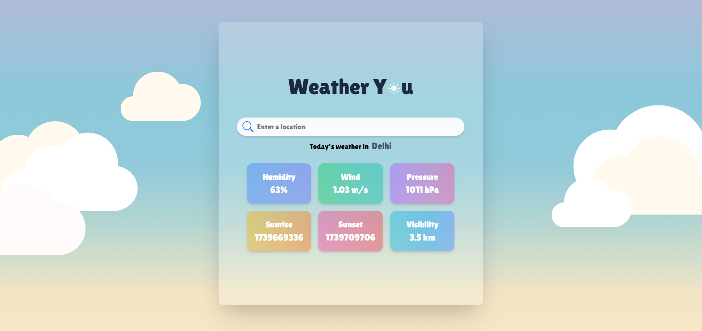
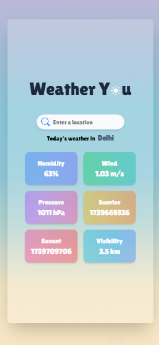

### **🌤️ Weather You - A Minimalistic Weather App**  

**Weather You** is a simple yet elegant weather application that provides real-time weather updates based on user input or their current location. Built with **React.js, Tailwind CSS, Framer Motion, and OpenWeather API**, this app ensures a smooth and interactive experience.  

---

## **🌟 Features**  

✅ **Real-time Weather Updates** - Get current weather details for any location.  
✅ **Geolocation Support** - Automatically fetches weather based on your current location.  
✅ **Smooth Animations** - Powered by Framer Motion for a beautiful UI experience.  
✅ **Weather Cards** - Displays temperature, humidity, wind speed, pressure, visibility, sunrise, and sunset.  
✅ **Responsive Design** - Fully optimized for mobile and desktop screens.  

---

## **🚀 Tech Stack**  

- **Frontend:** React.js, Tailwind CSS  
- **Animations:** Framer Motion  
- **API:** OpenWeatherMap API, Google Geolocation API  
- **State Management:** React Hooks (useState, useEffect)  

---

## **📸 Screenshots**  

### **Desktop view**  

  

### **Mobile view**  

  

---

## **🔧 Installation & Setup**  

1️⃣ Clone the repository:  

```sh
git clone https://github.com/biswarup-naha/Weather-app.git
cd Weather-app
```

2️⃣ Install dependencies:  

```sh
npm install
```

3️⃣ Set up your `.env` file:  

```sh
VITE_API_ID=your_openweather_api_key
VITE_GEO_API_KEY=your_google_geolocation_api_key
```

4️⃣ Run the app:  

```sh
npm run dev
```

5️⃣ Open in the browser:  

```
http://localhost:5173
```

---

## **🌍 API Configuration**  

- Sign up at [OpenWeatherMap](https://openweathermap.org/api) and get your **API Key**.  
- Enable Google Geolocation API from [Google Cloud Console](https://console.cloud.google.com/).  

---

## **🎯 Future Enhancements**  

🚀 **Hourly & Weekly Forecasts**  
🌙 **Dark Mode**  
📍 **Save Favorite Locations**  
📊 **Historical Weather Data**  

---

## **📜 License**  

This project is **open-source** and available under the [MIT License](LICENSE).  

---